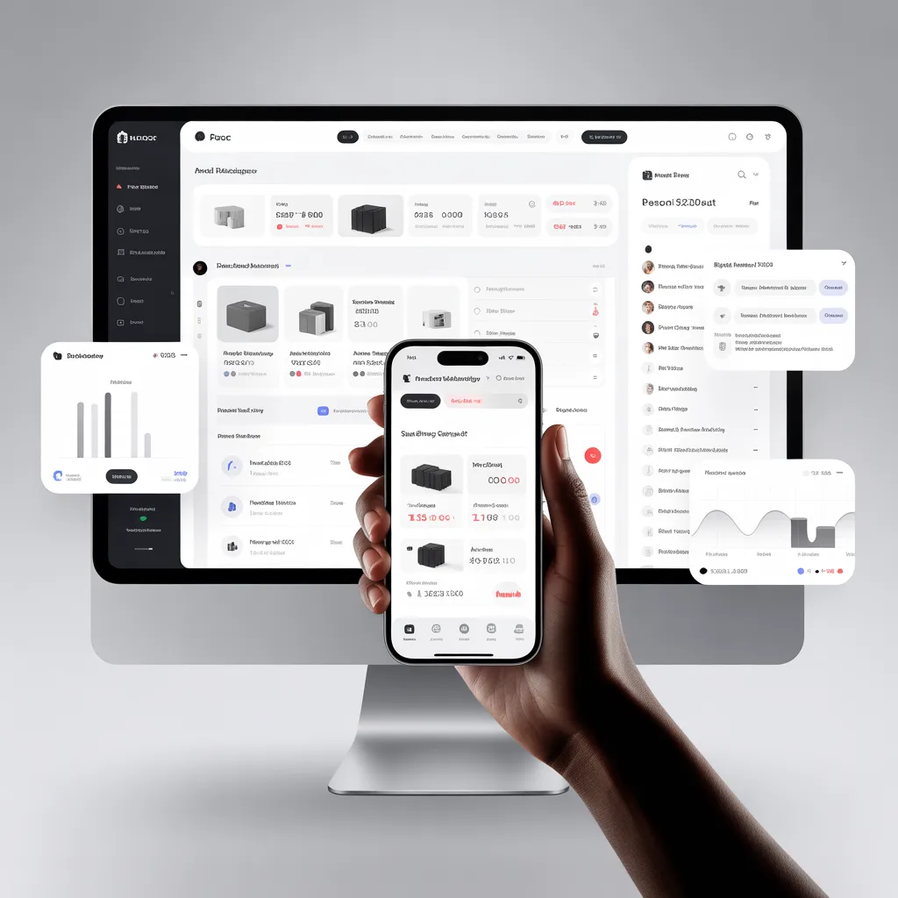

# 🐧 Gestly - La herramienta definitiva para tu negocio



**Gestly** es una plataforma integral de gestión empresarial diseñada para simplificar la administración de stock, ventas, empleados y sucursales. Pensada para comercios minoristas, gastronomía y servicios, Gestly elimina la complejidad del software tradicional con una interfaz moderna, rápida y accesible.

---

## ✨ Características Principales

*   **🛒 Punto de Venta (POS) Ágil**: Cobra en segundos con una interfaz intuitiva.
*   **📦 Gestión de Stock Inteligente**: Controla inventarios simples y complejos (talles, colores, recetas).
*   **🤖 Asistente IA**: Predicciones de stock y respuestas automáticas.
*   **🏢 Multi-Sucursal**: Gestiona múltiples locales desde un solo panel.
*   **👥 Control de Personal**: Roles, permisos y control de horarios.
*   **📊 Reportes en Tiempo Real**: Estadísticas detalladas de ventas y rendimiento.
*   **📱 Multiplataforma**: Funciona en PC, Tablet y Móvil.
*   **🔌 Modo Offline**: Sigue vendiendo sin internet.

---

## 🚀 Tecnologías

El proyecto está construido con un stack moderno enfocado en rendimiento y experiencia de usuario:

*   **Frontend**: [React](https://reactjs.org/) + [Vite](https://vitejs.dev/)
*   **Estilos**: [Tailwind CSS](https://tailwindcss.com/)
*   **Iconos**: [Lucide React](https://lucide.dev/)
*   **Internacionalización**: [i18next](https://www.i18next.com/)
*   **Enrutamiento**: [React Router](https://reactrouter.com/)

---

## 📂 Estructura del Proyecto

El código ha sido refactorizado para mantener una arquitectura limpia y escalable, alineada con los principios del Backend:

```bash
src/
├── app/                # Punto de entrada y configuración global
│   ├── App.jsx         # Enrutamiento principal (Landing, Auth, App)
│   └── main.jsx        # Montaje de la aplicación
├── assets/             # Recursos estáticos
│   └── images/         # Imágenes organizadas por contexto
├── i18n/               # Configuración de idiomas y traducciones
├── pages/              # Vistas principales (Feature-Based Architecture)
│   ├── About/          # Página "Sobre Nosotros"
│   │   ├── components/ # Componentes específicos de esta página
│   │   ├── hooks/      # Hooks específicos
│   │   └── stores/     # Estado local con Zustand
│   ├── Auth/           # Login y Onboarding
│   ├── Contact/        # Página de Contacto
│   ├── Guide/          # Guía y Tutoriales
│   ├── Landing/        # Landing Page (Home)
│   ├── Pricing/        # Página de Precios
│   └── WhatIsGestly/   # Explicación del producto
├── shared/             # Código compartido y reutilizable
│   ├── components/     # UI Kit (Botones, Navbar, Footer, etc.)
│   └── services/       # Capa de servicios HTTP (Axios/Fetch)
└── store/              # Estado global de la aplicación (si aplica)
```

### 🏗️ Arquitectura Frontend

La arquitectura sigue un enfoque modular basado en características (**Feature-Based**):

1.  **Shared Services (`src/shared/services`)**: Centraliza todas las llamadas HTTP a la API. Los componentes nunca hacen fetch directamente; usan estos servicios.
2.  **Zustand Stores (`src/pages/*/stores`)**: Cada página o módulo importante tiene su propio store de Zustand para manejar su estado local y lógica de negocio, consumiendo los servicios compartidos.
3.  **Components**: Los componentes de UI son "tontos" (presentacionales) y consumen datos y acciones desde los stores o hooks personalizados.
4.  **Hooks (`src/pages/*/hooks`)**: Lógica reutilizable específica de cada página.

Esta estructura facilita la escalabilidad, el testing y mantiene el código desacoplado, alineándose con las mejores prácticas de arquitectura de software.

---

## 🛠️ Instalación y Uso

1.  **Clonar el repositorio**:
    ```bash
    git clone https://github.com/tu-usuario/gestly.git
    cd gestly
    ```

2.  **Instalar dependencias**:
    ```bash
    npm install
    ```

3.  **Iniciar servidor de desarrollo**:
    ```bash
    npm run dev
    ```

4.  **Construir para producción**:
    ```bash
    npm run build
    ```

---

## 🎨 Filosofía de Diseño

Gestly sigue principios de diseño **"Luminous & Clean"**:
*   **Simplicidad Radical**: Interfaces que no requieren manual.
*   **Feedback Visual**: Animaciones suaves y micro-interacciones.
*   **Accesibilidad**: Contrastes cuidados y tipografía legible.

---

© 2026 Gestly Inc.
